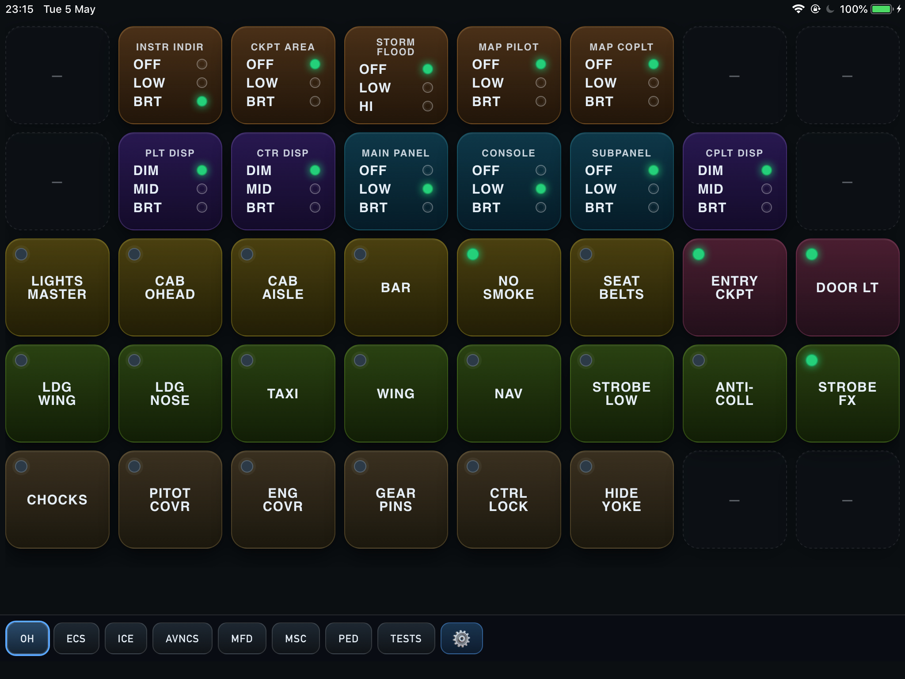
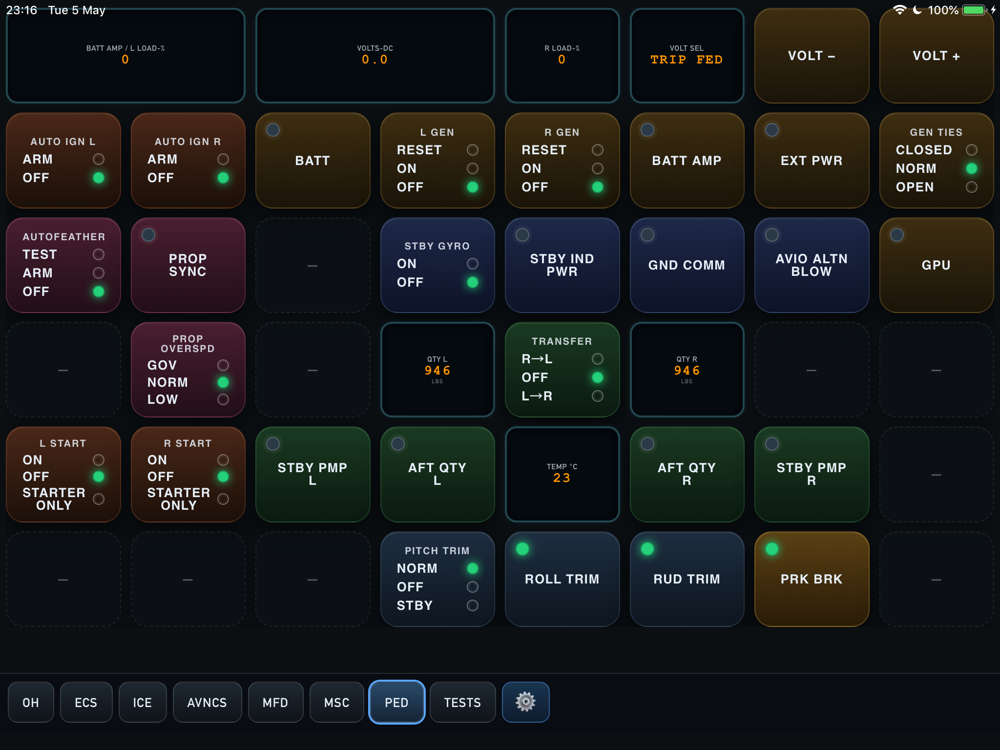
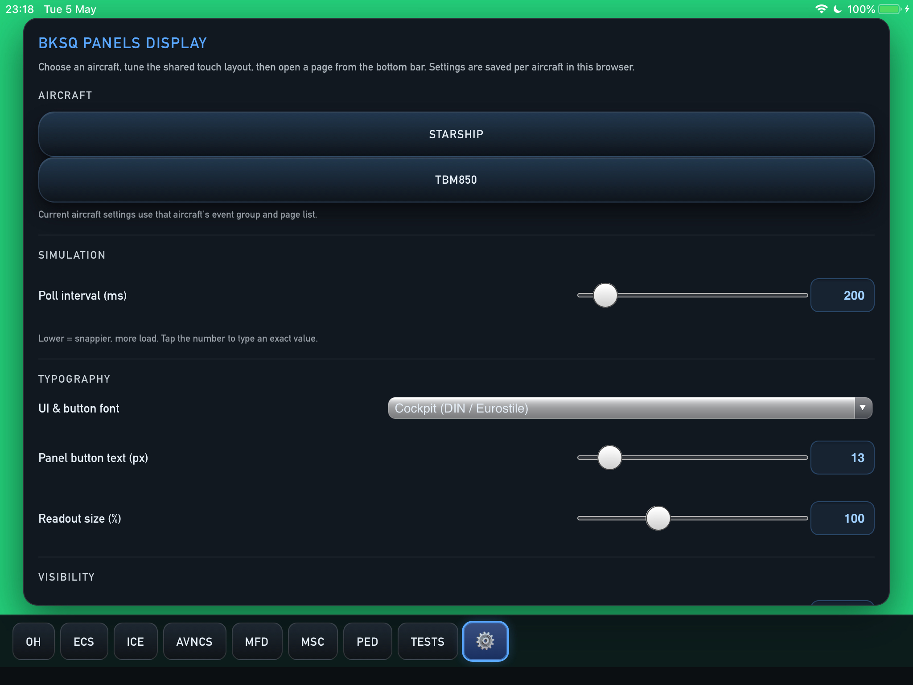
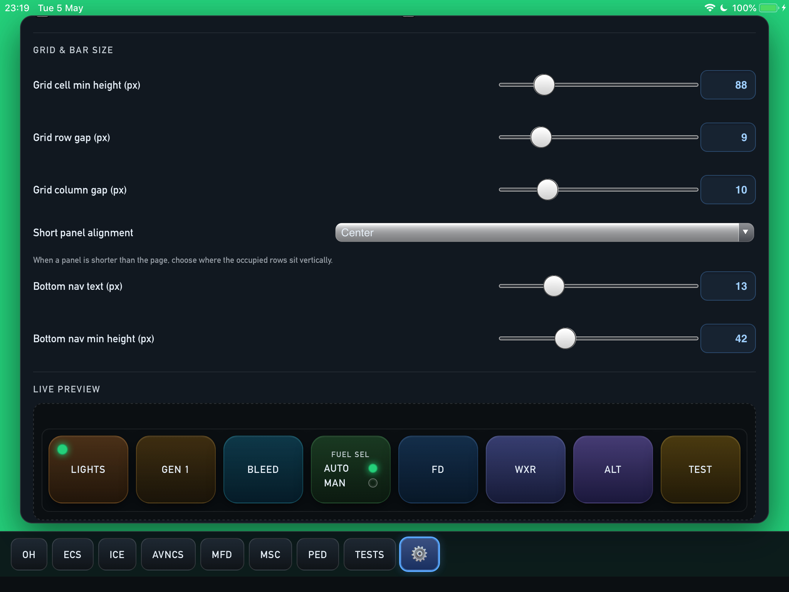
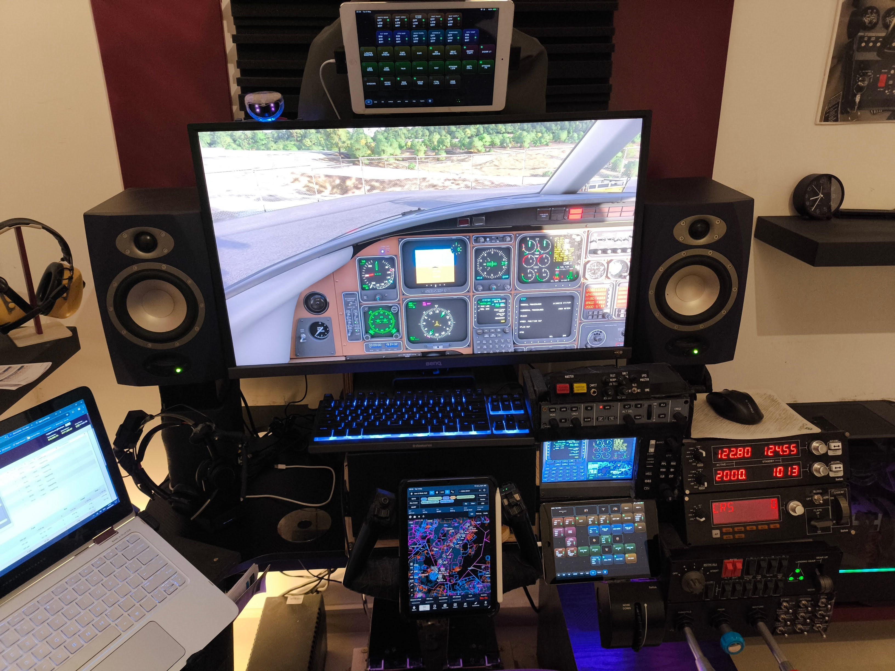

# BlackSquare AAO web panels

A "touch-portal" like web panels for **Black Square** aircraft in **AxisAndOhs (AAO)**. Supporting desktop/mobile browsers, designed to support older hardware. Tested extenstively with iPad Air 1 / ipad mini 2 , running iOS 12.5.x .

## Features
- Support for Starship panels and TBM 850 (still WIP).
- Touch friendly buttons with support for touch visual feedback, button state indicator, multi-state button indicator and live data feed info boxes.
- Flexiable button sizes and text to adapt to different devices, screen sizes and touch area.
- Simplified panel page definition (javascript) to easily change page layout buttons with minimal code.

## Starship Panels
&nbsp;&nbsp;&nbsp;&nbsp;&nbsp;  


## Settings Page
&nbsp;&nbsp;&nbsp;&nbsp;&nbsp;  


## Poor man's SimPit
Panels in use, Old iPad Air as overhead panel, and ipad mini 2 for pedestal / avionics / misc pages.

</div>


## Installation

1. **Copy** the entire `bksq-panels` folder into the directory AAO serves as web content (same idea as the stock AAO panel template).
2. **Import** the aircraft script package you need in AAO (one XML per aircraft so labels stay unambiguous):
   - Starship: `aircraft/starship/bksq-starship-scripts.xml`
   - TBM850: `aircraft/tbm850/bksq-tbm850-scripts.xml`
3. **Open** `index.html` from this folder in the browser (or add it as an AAO web panel URL pointing at that file).

MSFS must be running with AAO connected; the panels talk to the sim through AAO’s web API (`common/AaoWebApi.js`).

---

## Usage

### Hub and aircraft selection

- Open **`index.html`**. It loads **`?aircraft=starship`** or **`?aircraft=tbm850`** (default is Starship if the query is missing or unknown).
- The hub shows **Settings** and links into each aircraft’s panel pages.
- From any panel page, use the **bottom nav** to switch pages; the **gear** link opens the hub settings (`index.html?aircraft=…#settings`).

### Panel pages

- **Starship**: overhead, ECS, anti-ice, avionics (AP) deck, MFD shell, misc, pedestal, tests — see `aircraft/starship/aircraft.js` → `pages`.
- **TBM850**: overhead, avionics — see `aircraft/tbm850/aircraft.js`.

### iOS / home-screen web app

Scripts keep navigation inside the app (see `common/nav-inapp.js`). Add to home screen as usual; panel and settings links should stay in the web view instead of jumping to Mobile Safari.

---

## Settings

Settings are edited on **`index.html`** (the hub). They are **saved per aircraft** in the browser using **`localStorage`**, under the key defined in each `aircraft/<id>/aircraft.js` as **`storageKey`** (e.g. `bksq-starship-ui-settings-v1`).

| Area | What it controls |
|------|------------------|
| **Aircraft** | Which aircraft’s defaults and nav list apply on the hub. |
| **Simulation** | **Poll interval (ms)** — how often the panel asks AAO for L:vars / updates (clamped 50–2000 ms). |
| **Typography** | UI font preset, **panel button text size**, gauge readout scale. |
| **Visibility** | Brightness, lamp/indicator scale, reduce motion, touch flash, scrollable panel pages. |
| **Bottom nav** | Show/hide individual tabs for the current aircraft. |
| **Grid & bar** | Minimum row height, row/column gaps, vertical alignment when a panel is short, bottom bar font/height. |

Default numeric values come from **`aircraft.js`** → **`defaults`** for that aircraft. Changing aircraft on the hub switches which saved profile is loaded.

---

## Repository layout

```text
index.html                 # Hub: aircraft pick + settings
common/
  AaoWebApi.js             # AAO bridge (StartAPI, SendEvent, GetSimVar, …)
  common.css, common.js    # Shared UI + sendP / getLVar / getAVar helpers
  nav-inapp.js               # In-app navigation (esp. iOS standalone)
  panel-runtime.js           # Boot, poll loop, declarative poll kinds
  panel-settings.js          # Hub settings UI + apply CSS variables
  panel-builder.js           # Layout → HTML + polls; SSP_PANEL_FACTORY
aircraft/
  starship/
    aircraft.js              # BKSQ_AIRCRAFT meta, pages[], defaults, storageKey
    config/buttons.js        # SSP_BUTTONS + StarshipPanel factory
    config/panels/*.js       # Per-page layout: arrays of button names
    pages/*.html             # Thin shells: scripts + SSPRuntime.boot('…')
    panels/overrides.js      # Extra onPoll logic (temps, gauges, XPDR, …)
    bksq-starship-scripts.xml
  tbm850/
    aircraft.js
    config/buttons.js        # TBM_BUTTONS + TBMPanel factory
    config/panels/*.js
    pages/*.html
    panels/overrides.js
    bksq-tbm850-scripts.xml
```

Starship and TBM both use the **same** `common/panel-builder.js`. Aircraft-specific markup and polls live in **`config/buttons.js`**; each page only lists **layout** tokens in **`config/panels/<page>.js`**.

---

## Editing layouts

Layouts are **flat lists** of token strings passed to **`StarshipPanel({ … })`** or **`TBMPanel({ … })`** (see any `config/panels/*.js`).

- **`'empty'`** — spacer / placeholder cell (uses the `empty` entry in the button dictionary).
- **`'lts_instrIndir'`**, **`'ice_wsL'`**, … — names of entries in **`config/buttons.js`**.

The builder concatenates each entry’s **`html`** and **`polls`** once at load time. The runtime still does a single **`#grid.innerHTML = …`** per page, same as hand-written HTML.

**Grid row width** is implicit: each contiguous run of tokens in the array forms one row only if your page is designed that way. In practice, Starship panel files group **8** cells per row (or **6** on the pedestal’s first row where two cells are `wide-2` gauges). Keep the same counts as the existing pages when rearranging.

**Special grids**: Starship **anti-ice** uses `gridClass: 'grid ice-grid'`; CSS **`p-*`** classes on buttons position cells — order in the layout array is not visual order.

---

## Developing: button naming (`config/buttons.js`)

Tokens are grouped by **system prefix** so you can add controls without tying names to a single page:

| Prefix | Typical use |
|--------|-------------|
| `lts_` | Lighting / panel lights |
| `gnd_` | Ground safety (Starship OH) |
| `ice_` | Anti-ice / deice |
| `avncs_` | Avionics deck, AP, fire, xpdr, chrono, TBM EFIS/TAWS/XPDR |
| `ecs_` | Environmental, bleed, press, ECS oxygen |
| `misc_` | Misc panel |
| `elec_` | Pedestal electrical |
| `eng_` | Ignition, starters |
| `prop_` | Propeller (autofeather, sync, governor) |
| `fuel_` | Fuel |
| `pedst_` | Pedestal avionics services (stby gyro, GND COMM, alt blow) |
| `trim_` | Trim, parking brake |
| `oxy_` | TBM oxygen |
| `test_` | Starship test holds |

**DOM element `id`s and `SSP_*` labels** should stay **stable** if you rename layout tokens: sim bindings and `overrides.js` key off those ids and event names.

### Adding a button (declarative panel)

1. Open **`aircraft/<aircraft>/config/buttons.js`**.
2. Add a property **`myPrefix_myControl`** with:
   - **`html`**: string from helpers on **`window.SSPPanelHelpers`** (`sendButton`, `button`, `dual`, `gauge`, `holdButton`, …), or raw HTML if needed.
   - **`polls`** (optional): array of poll objects; kinds are implemented in **`common/panel-runtime.js`** (`toggle`, `toggleA`, `lamps`, `testLatched`, `avarText`, `custom`, …).
3. Append **`'myPrefix_myControl'`** to the right place in **`config/panels/<page>.js`** **`layout`** array.
4. If you introduce a **new `SSP_*` label**, add it to that aircraft’s **`.xml`** and run **`node aircraft/starship/tools/check-manifest.js`** (Starship) to catch typos.

**TBM** uses **`sendTbmP`** for SSP events: pass **`sender: 'sendTbmP'`** in `sendButton` options (see existing `sspButton` wrapper in TBM `buttons.js`).

**Starship** defaults to **`sendP`**.

### Helpers (`common/panel-builder.js`)

- **`sendButton(cls, label, sspLabel, { id, ind, sender })`** — click sends `sendP('SSP_…')` or `sendTbmP('SSP_…')`.
- **`button(cls, label, onclickJs, id, ind)`** — arbitrary `onclick` source string.
- **`dual(…)`** — multi-lamp / multi-row controls.
- **`gauge(…)`** — readout cells.
- **`holdButton(cls, label, sspLabel, { id, ind, holdMs })`** — test-style **`SSPRuntime.testHold`** (Starship tests page).

---

## Developing: new panel page

1. **`aircraft/<id>/aircraft.js`** — add **`{ id, label, navLabel, href }`** to **`pages`** (this drives the hub and optional nav visibility).
2. **`aircraft/<id>/pages/<name>.html`** — copy an existing page; fix **title**, **nav** `active` / `href`, **`SSPRuntime.boot('panelId')`**, and script order:
   - `nav-inapp.js` → `common.js` → **`panel-builder.js`** → **`../config/buttons.js`** → **`../config/panels/<name>.js`** → **`panel-runtime.js`** → **`../panels/overrides.js`** → boot.
3. **`aircraft/<id>/config/panels/<name>.js`** — set **`window.SSP_PANELS.<panelId> = StarshipPanel({ … })`** (or **`TBMPanel`**) with **`id`**, **`layout`**, and optional **`gridClass`**, **`pollIntervalMs`**, **`extraPolls`**.

**Special cases**

- **MFD** / custom UIs may use **`renderMode: 'innerHtml'`** and a pre-built string, or legacy **`rows`/`cells`** (see **`aircraft/starship/CONFIG.md`**).
- **Starship tests** use the shared **`buttons.js`** entries under **`test_*`** and a normal **`StarshipPanel`** layout.

---

## Overrides and complex logic

Put per-tick or cross-control logic in **`aircraft/<id>/panels/overrides.js`**: **`SSP_PANEL_OVERRIDES.onPoll(panelId, ctx)`** runs after declarative **`polls`**. Use **`custom`** poll entries to delegate a single slot to a function in **`SSP_PANEL_OVERRIDES.polls[id]`** if needed.

---

## Optional checks and local preview

- **Starship script manifest**: from `aircraft/starship`, run **`node tools/check-manifest.js`**. It scans **`config/panels/*.js`** and **`config/buttons.js`** for **`SSP_*`** strings and compares them to **`bksq-starship-scripts.xml`**.
- **Quick local server**: from repo root, `python -m http.server 8080` — open `http://127.0.0.1:8080/index.html`. The simulator is still required for real AAO traffic; without it you will see expected API errors in the console.
- **`_test_unify.py`** (Playwright): smoke-test that panels boot and expected element ids exist (optional dev dependency).

---

## Further reading

- **`aircraft/starship/CONFIG.md`** — panel object fields, **`rows`/`cells`** cell schema, poll kinds reference.
- **`aircraft/tbm850/CONFIG.md`** — TBM **`SSP_TBM_*`** notes, circuit indices, logic that stays in JS.

There is no shared aircraft XML in this bundle; each type keeps its own **`bksq-*-scripts.xml`**. If a future aircraft shares RPN, you could add something like **`common/common-bksq-panel.xml`** and document the import order here.
